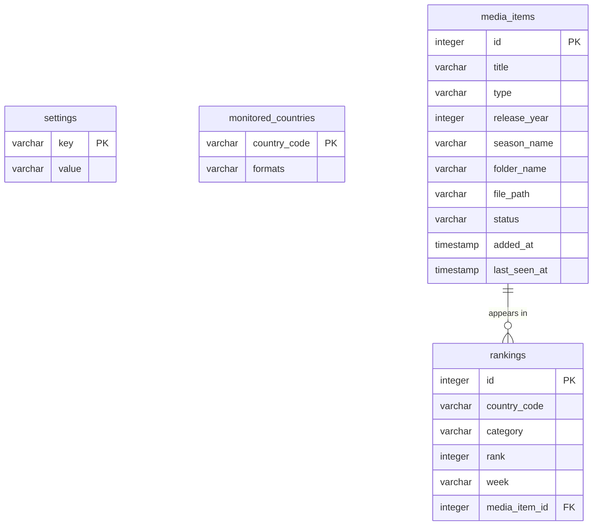
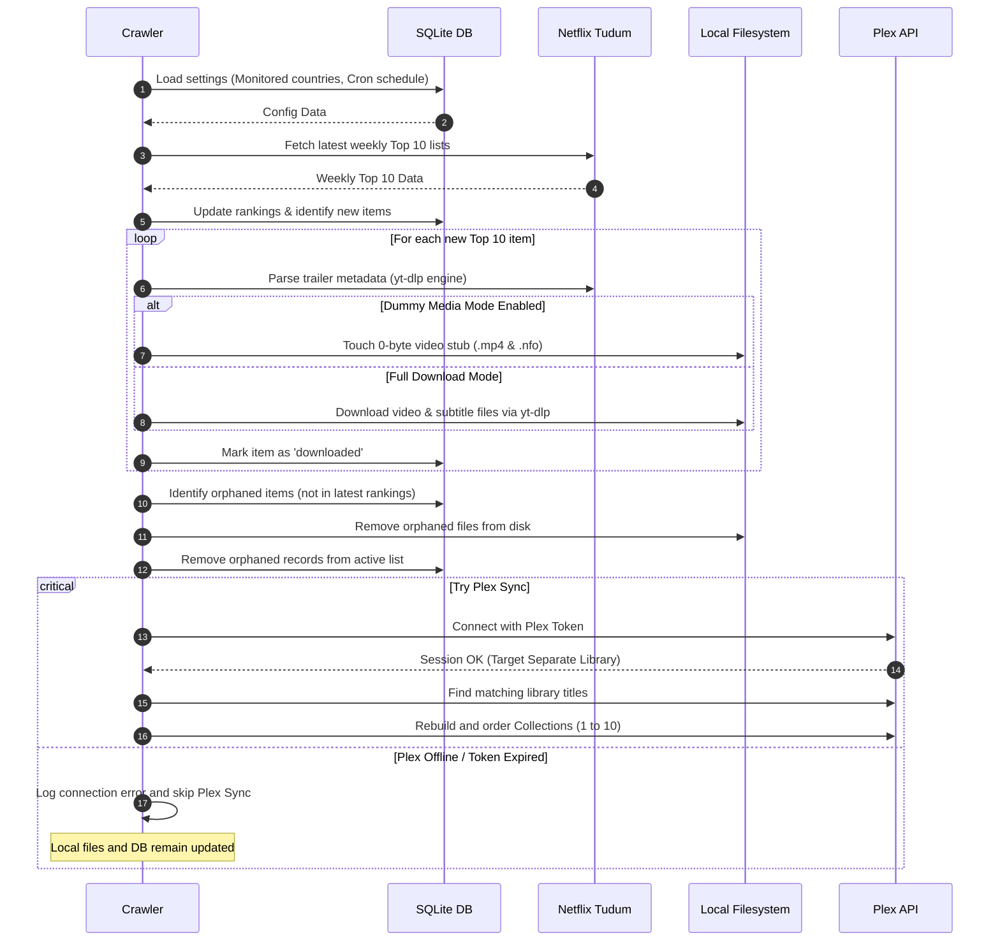

# NetPlex Architecture & System Design 📐

This document outlines the internal architecture, database schema, data pipelines, and technology choice for NetPlex.

---

## 🛠️ Technology Choice: Python

NetPlex is built using **Python**. The primary reasons for this architectural choice are:
1. **Plex Integration Ecosystem**: Python has the most mature, official, and robust Plex client library (`plexapi`). It supports advanced Plex interactions, including collection re-ordering and Plex PIN-based authentication.
2. **Built-in Database Support**: Python includes `sqlite3` in its standard library, allowing database-driven configuration and metadata caching without requiring separate database server installations or heavy drivers.
3. **Media Scraping Ecosystem**: Python excels at document parsing. Using libraries like `requests` and `BeautifulSoup`, it can parse public Netflix title structures and editorial CDNs to isolate raw trailer files and subtitle tracks.
4. **Lightweight Web Stack**: Python supports clean, micro-web frameworks like FastAPI or Flask, enabling a clean Web Settings UI with low memory overhead.

---

## 🏗️ System Components

NetPlex is designed with two mapped volumes:
* `/config`: Hosts application database files, certificates, and runtime cache.
* `/data`: Structured media directory containing Plex-optimized folders (`movies/` and `tv/`).

```mermaid
graph TD
    %% Component Layers %%
    subgraph config_volume ["Config Volume (/config)"]
        DB[("netplex.db (SQLite)")]
    end
    
    subgraph web_interface ["Web Interface (Port 8000)"]
        UI["Landing & Settings Pages"] -->|Read/Write| DB
    end
    
    subgraph ingestion_pipeline ["Ingestion Pipeline"]
        C["Crawler Cron"] -->|1. Query Monitored Config| DB
        C -->|2. Fetch Latest Weekly List| N["Netflix Top 10 API"]
        C -->|3. Resolve Tudum/CDN Media| CD["Netflix CDN / Web Scraper"]
        CD -->|Download Video & Subtitles| DV[("/data Volume")]
    end
    
    subgraph sync_pipeline ["Sync Pipeline"]
        C -->|4. Trigger Plex Sync| PX["Plex Sync Agent"]
        PX -->|5. Read Cache| DB
        PX -->|6. Connect & Update Collections| PM["Plex Media Server"]
    end
    
    style config_volume fill:#1b1b1e,stroke:#3a3a3c
    style web_interface fill:#1b1b1e,stroke:#3a3a3c
```

---

## 🖥️ Web Server & UI Design

NetPlex exposes a lightweight web server that renders a frontend on port `8000`. 

### 1. Access Control
Access to the NetPlex dashboard is **completely unauthenticated by default**. This allows you to view your local Top 10 collection immediately without credentials. User credentials are strictly used for Plex API synchronization in the background.

### 2. Page Structure
The frontend consists of two main pages:
* **Landing Page (`/`)**: A clean grid view showing the active Top 10 lists fetched from the SQLite database. Shows rankings in the exact Netflix order (1 through 10), complete with local summary data and video trailer overlays. This page operates standalone even if a Plex server is not connected.
* **Settings Page (`/settings`)**: Configures the scraper. Includes:
  * Checkboxes or radio buttons to customize tracked countries and content formats (e.g. checkbox for `Movies` and `TV Shows`).
  * Plex sign-in redirect button (Plex OAuth).
  * Synchronization log viewer and manual crawl triggers.

### 3. Tudum Visual Identity & Local Static Styling
* **Aesthetics**: The UI closely matches the Netflix Tudum editorial look, featuring a bold dark background, Netflix red accents (`#E50914`), heavy header typography, and smooth card zoom hovers.
* **Static Assets**: All visual styles and client interaction scripts are cleanly organized under `src/web/static/`, consolidated into `src/web/static/css/netflex.css` and `src/web/static/js/netflex.js`.

---

## 🗄️ Database Schema (`netplex.db`)

All application settings, monitored states, and download logs are stored in a SQLite database located at `/config/netplex.db`.

### 1. `settings` Table
Stores general global settings editable via the Web UI:
* `plex_url`: The address of the Plex Media Server.
* `plex_token`: The authenticated Plex API token.
* `cron_expression`: Standard 5-field Cron expression for scraper runs (defaults to `0 0 * * 2` for weekly Tuesday runs).
* `log_level`: Level of detail in execution logs.
* `dummy_media_mode`: Flag (`true`/`false`) to generate zero-byte `.mp4` dummy files instead of downloading full video streams.

### 2. `monitored_countries` Table
Stores country-specific formats:
* `country_code` (e.g. `US`, `DE`).
* `formats`: `movies`, `tv`, or `both`.

### 3. `media_items` Table
Tracks unique movies and series downloaded on disk:
* `id` (Primary Key).
* `title`: Title of the movie or show.
* `type`: `movie` or `tv`.
* `release_year`: Extracted release year.
* `season_name`: Extracted season name (e.g. `Season 1`).
* `folder_name`: Name of the directory on disk (e.g., `Stranger Things (2016)`).
* `status`: `pending`, `downloaded`, or `failed`.
* `last_seen_at`: Timestamp of the last time this item appeared in any active Top 10 list.

> [!NOTE]
> **Database Footprint & Cleanup**: NetPlex only stores and monitors data for the **latest week's Top 10 charts**. Older week records and dropped media files are pruned automatically by the cleanup daemon, keeping SQLite database storage and disk space footprint minimal.

---

## 🔄 Execution Sequence & Resiliency

NetPlex prioritizes keeping local media updated before interacting with Plex. We strongly recommend pointing NetPlex to a **dedicated, separate Plex library** (e.g. `Netflix Top 10`) rather than merging with existing main media libraries. If Plex is unavailable or offline, the local database and files remain fully functional.

---

## 🔗 Related Documentation

* Returning to home: **[README.md](../README.md)**
* Configuration reference: **[configuration.md](configuration.md)**
* Deployment instructions: **[deployment.md](deployment.md)**
* Plex configuration and scanning: **[plex-integration.md](plex-integration.md)**
