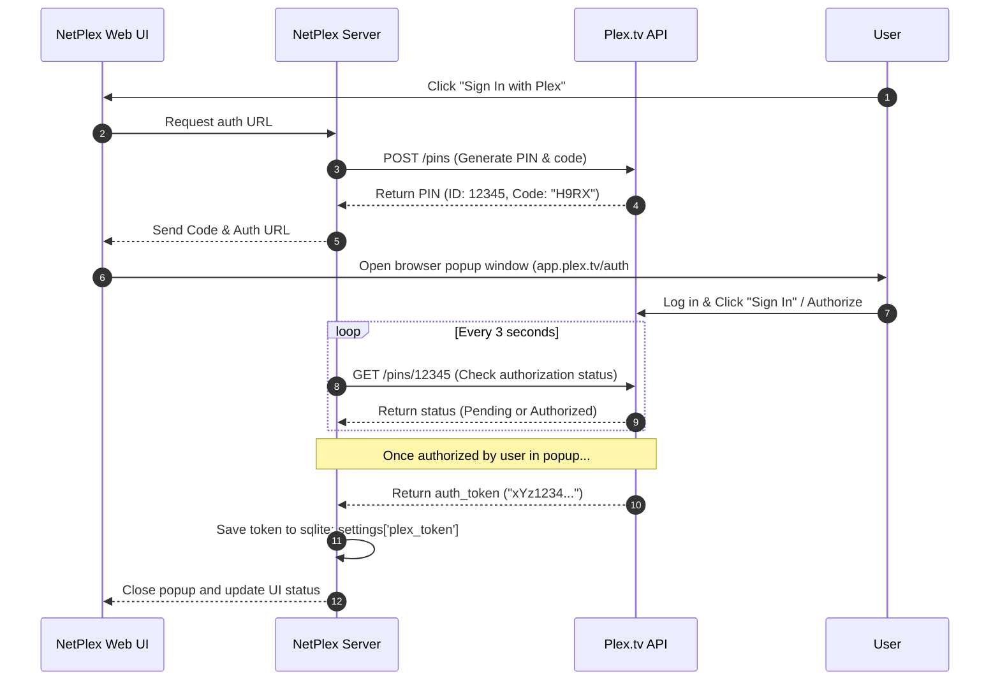

# Plex Media Server Integration Guide 🎛️

This document describes how to configure your Plex Media Server to integrate with NetPlex, covering **Library Integration** (using separate dedicated Plex libraries) and **API Sync Integration** (Plex PIN flows & collections).

---

## 📁 Library Configuration (Local Assets & Separate Libraries)

> [!IMPORTANT]
> **Recommended Best Practice**: NetPlex should be configured in Plex using its own **dedicated, separate libraries** (e.g. `Netflix Top 10 - Movies` and `Netflix Top 10 - TV Shows`) without merging into existing main movie or TV libraries. Because NetPlex manages its own content lifecycle (automatically creating and pruning weekly entries), running it in a dedicated library ensures clean isolation.

NetPlex generates a flat, lean file layout under `/data`. In Plex, map separate libraries for movies and TV shows:

### 1. Movies Library
1. In Plex Web App, go to **Settings** > **Manage** > **Libraries** > **Add Library**.
2. Select **Movies** as the library type.
3. Name it `Netflix Top 10 - Movies`.
4. Add the folder `/data/movies` (mapped from your container volume).
5. Under the **Advanced** tab, check that **Local Media Assets** is enabled. NetPlex generates local `movie.nfo` files to provide accurate summaries and metadata.

### 2. TV Shows Library
1. In Plex Web App, select **Add Library**.
2. Select **TV Shows** as the library type.
3. Name it `Netflix Top 10 - TV Shows`.
4. Add the folder `/data/tv` (mapped from your container volume).
5. In the **Advanced** tab, make sure the metadata agent is configured to read local NFOs.

### 3. Dummy (Zero-Byte) Media Mode
NetPlex supports creating **0-byte dummy trailer files** (`.mp4`/`.mkv`) alongside NFO metadata files. When Dummy Media Mode is enabled, Plex reads the NFO metadata and indexes the item into custom collections without requiring full video downloads.

---

## 📺 Naming TV Series (Episode 0 Specials)

Plex has a strict folder and file structure for TV Shows to parse them into its database. To keep the folder structure extremely lean while ensuring Plex parses trailers correctly, NetPlex maps trailers as **Episode 0 (Specials)** inside the corresponding season:

```text
/data/tv/ Stranger Things (2016)/
└── Season 01/
    ├── S01E00 - Trailer.mp4       # Mapped as Episode 0 (Special)
    ├── S01E00 - Trailer.en.srt    # Subtitle file
    └── tvshow.nfo                 # Series metadata
```

* **Why Episode 0?** Mapping the trailer as `S01E00` (Season 1, Episode 0) tells Plex that this is a special preview/featurette associated with Season 1. This prevents Plex from misinterpreting the trailer as a standard episode (like Episode 1), which would result in missing summaries or mismatching metadata.

---

## 🔌 API Sync Mode & Plex PIN Authentication

API Sync Mode allows NetPlex to build custom playlists and collections out of movies/shows you already own. NetPlex features a user-friendly authentication flow similar to ARR stack tools (e.g. Overseerr, Tautulli).



### Authentication Steps:
1. Navigate to the **Settings** page in the NetPlex Web UI.
2. Click **Sign In with Plex**.
3. A secure browser popup window will open pointing to Plex's official domain (`app.plex.tv`).
4. Log into your Plex account inside that popup window and click **Sign In**.
5. The popup window will automatically close when authorization is complete, and NetPlex will save the permanent Plex API Token to its SQLite database.

---

## 🛡️ Offline Resiliency & Development Cache

The NetPlex synchronization cycle is decoupled into two independent phases:

```text
┌────────────────────────────────┐
│   Phase 1: Local Asset Sync    │
│  (Scrapes Tudum -> Downloads   │
│   Trailers -> Deletes Orphans) │
└───────────────┬────────────────┘
                │
                ▼
┌────────────────────────────────┐
│    Phase 2: Plex API Sync      │
│  (Fuzzy-Matches local stubs    │
│   and configures Collections)   │
└────────────────────────────────┘
```

* **Offline Resiliency**: If your Plex server is offline, or if your Plex authentication token has expired, **Phase 1** still executes completely. NetPlex continues to scraper data, download new trailers, compile local `.nfo` metadata, and prune old files.
* **Development benefits**: During development, you can run the app locally, fetch Tudum pages, and verify the folder structures and SQLite schemas without needing a local running Plex Server or a valid Plex Token.

---

## 🔗 Related Documentation

* Returning to home: **[README.md](../README.md)**
* Ingestion pipeline and database schemas: **[architecture.md](architecture.md)**
* Configuration reference: **[configuration.md](configuration.md)**
* Deployment instructions: **[deployment.md](deployment.md)**
